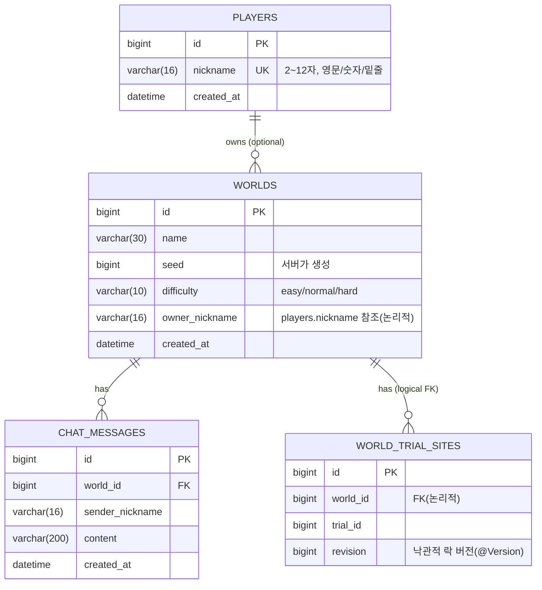

# WebCraft 실시간 게임 서버

스프링 부트 기반 실시간 멀티플레이어 게임 서버 과제입니다. 플레이어 등록, 월드 생성/조회, 실시간 채팅과 플레이어 이동을 REST API와 WebSocket으로 제공합니다.

## 기술 스택

- Java 21, Spring Boot 4.1
- MySQL 8.0 (JPA/Hibernate) — 영구 데이터 저장
- Redis 7.4 — 접속 상태(Presence), 최근 채팅 캐시, 채팅 전송 횟수 제한, 서버 간 채팅 릴레이(Pub/Sub)
- Spring WebSocket — 실시간 이동/채팅/접속자 조회
- Docker Compose — MySQL, Redis, 애플리케이션 서버 실행

## 아키텍처

Controller → Service → Repository의 3 Layer 구조이며, 엔티티 연관관계는 단방향만 사용합니다.

```
Client (Browser / Postman)
   │  REST (플레이어/월드/채팅 조회)
   │  WebSocket (이동/채팅/접속자/ping)
   ▼
Controller ─▶ Service ─▶ Repository ─▶ MySQL
                 │
                 ├─▶ Redis (Presence, 캐시, 레이트리밋)
                 └─▶ Redis Pub/Sub ─▶ 다른 서버 인스턴스 (멀티 서버 채팅 릴레이)
```

## ERD



- `chat_messages.world_id`는 `worlds.id`를 참조하는 실제 `@ManyToOne` 연관관계이며, 월드별 최근 채팅 조회 성능을 위해 `(world_id, created_at)` 복합 인덱스(`idx_chat_world_created_at`)를 가집니다.
- `worlds.owner_nickname`, `world_trial_sites.world_id`는 DB 제약(FK)이 아닌 애플리케이션 레벨의 논리적 참조입니다.

## 실행 방법

```bash
# MySQL + Redis (+ 서버 1개) 로컬 개발 실행
docker-compose up -d mysql redis
./gradlew bootRun
# http://localhost:8080 에서 게임 실행

# 멀티 서버(2개) 전체 실행 — Lv20 확인용
docker-compose up -d
# 서버 A: http://localhost:8080, 서버 B: http://localhost:8081 (같은 MySQL/Redis 공유)
```

## REST API 명세

| 메서드 | 경로 | 설명 | 성공 |
| --- | --- | --- | --- |
| POST | `/players` | 닉네임으로 플레이어 등록 | 201 |
| GET | `/worlds` | 월드 목록 조회 (최대 3개, 접속 인원 포함) | 200 |
| POST | `/worlds` | 월드 생성 | 201 |
| GET | `/worlds/{worldId}/chats?limit=` | 최근 채팅 조회 (오래된 → 최신 순) | 200 |
| GET | `/worlds/{worldId}/chats/history?beforeCreatedAt=&beforeId=&limit=` | 과거 채팅 커서 페이지 조회 (최신 → 과거 순) | 200 |

### 오류 코드

| error | 상태 | 상황 |
| --- | --- | --- |
| VALIDATION_FAILED | 400 | 필수 값 누락, 길이/패턴 위반, 잘못된 숫자 파라미터 |
| INVALID_REQUEST_BODY | 400 | 잘못된 JSON, 알 수 없는 필드/난이도 |
| WORLD_NOT_FOUND | 404 | 존재하지 않는 월드 |
| PLAYER_NOT_FOUND | 404 | 등록되지 않은 닉네임으로 월드 생성 |
| DUPLICATE_NICKNAME | 409 | 이미 등록된 닉네임 |
| WORLD_LIMIT_REACHED | 409 | 월드가 이미 3개인 상태에서 생성 시도 |
| INTERNAL_ERROR | 500 | 예기치 못한 서버 오류 |
| WORLD_BASELINE_INITIALIZING | 503 | 서버 기동 직후 월드 준비가 끝나기 전 |

## WebSocket 메시지 명세

연결: `ws://localhost:8080/ws/worlds/{worldId}?nickname={nickname}` (사전에 `POST /players`로 등록 필요)

### 핸드셰이크 종료 코드

| 코드 | 상황 |
| --- | --- |
| 4000 | 닉네임 누락 또는 등록되지 않은 닉네임 |
| 4001 | 접속할 수 없는 월드 ID |
| 4002 | 같은 월드에 같은 닉네임이 이미 접속 중 (기존 연결 유지) |

### 클라이언트 → 서버

| type | 설명 | 필드 |
| --- | --- | --- |
| `ping` | 연결 확인 (15초 주기), Redis 접속 상태 갱신 | - |
| `chat` | 채팅 전송 (1~200자, 10초당 최대 5건) | `content` |
| `move` | 이동/시선/상태 갱신 | `x,y,z,yaw,pitch,crouching,gliding` |
| `onlineUsers` | 현재 월드 접속자 목록 요청 | - |

### 서버 → 클라이언트

| type | 설명 | 필드 |
| --- | --- | --- |
| `pong` | ping 응답 | - |
| `chat` | 같은 월드 전체에 채팅 전달 (멀티 서버 시 Redis Pub/Sub로 다른 서버까지 전달) | `sender,content,timestamp` |
| `onlineUsers` | 요청자에게만 응답 | `users(정렬됨),count` |
| `error` | 메시지 처리 오류 | `code` (INVALID_JSON, INVALID_MESSAGE, UNKNOWN_TYPE, INTERNAL_ERROR, CHAT_COOLDOWN) |

## 구현 범위

| 레벨 | 내용 | 상태 |
| --- | --- | --- |
| Lv1~15 | 필수: Docker 환경, 인덱스, 플레이어/월드/채팅 REST API, WebSocket 연결·세션·Presence·이동·채팅·접속자 목록 | 완료 |
| Lv16 | 도전: 낙관적 락 (`@Version`) | 완료 |
| Lv17 | 도전: 채팅 커서 페이지네이션 | 완료 |
| Lv18 | 도전: Redis 최근 채팅 캐시 (TTL 5초) | 완료 |
| Lv19 | 도전: Redis Lua 스크립트 기반 채팅 횟수 제한 | 완료 |
| Lv20 | 보너스: Redis Pub/Sub 멀티 서버 채팅 릴레이 | 완료 |

## 질문 답변

**Redis와 MySQL의 차이는 무엇인가요?**

MySQL은 디스크 기반으로 데이터를 영구 저장하는 관계형 DB로, ACID 트랜잭션과 관계형 스키마·조인을 지원합니다. 이 프로젝트에서는 플레이어, 월드, 채팅처럼 서버가 재시작돼도 남아 있어야 하는 데이터를 저장하는 데 사용합니다.

Redis는 인메모리 key-value 저장소로 읽기/쓰기가 매우 빠르고, TTL(만료), Sorted Set, Pub/Sub 같은 다양한 자료구조·기능을 제공하지만 기본적으로 휘발성이 강하고 복잡한 관계형 조회에는 적합하지 않습니다. 이 프로젝트에서는 접속 상태(Presence), 최근 채팅 캐시, 채팅 횟수 제한 카운터, 서버 간 메시지 릴레이(Pub/Sub)처럼 "빠르게 갱신되고 일정 시간만 유효하면 되는" 데이터에 사용합니다.

**채팅 기능에 SSE보다는 WebSocket을 더 선호하는 이유는 무엇인가요?**

SSE(Server-Sent Events)는 서버 → 클라이언트 단방향 스트리밍만 지원합니다. 채팅은 클라이언트가 메시지를 보내는 동작이 필수인데, SSE만으로는 이를 처리할 수 없어 별도의 HTTP 요청을 함께 써야 합니다. 반면 WebSocket은 하나의 연결로 양방향 저지연 통신이 가능해서, 채팅뿐 아니라 이동, ping/pong, 접속자 조회 같은 다양한 실시간 상호작용을 같은 커넥션에서 자연스럽게 처리할 수 있습니다. 또한 SSE는 브라우저의 도메인당 동시 연결 수 제한(HTTP/1.1 기준) 같은 제약도 있어, 다수의 실시간 상호작용이 필요한 게임에는 WebSocket이 더 적합합니다.

**Pub/Sub에서 Publisher와 Subscriber는 각각 어떤 역할을 하나요?**

Publisher는 특정 채널에 메시지를 발행하는 주체입니다. 이 프로젝트에서는 채팅을 저장한 서버가 `ChatRelay.publish()`로 Redis 채널(`webcraft:chat`)에 메시지를 발행합니다. Subscriber는 채널을 구독하고 있다가 발행된 메시지를 받아 처리하는 주체로, 이 프로젝트에서는 (발행한 서버 자신을 포함한) 모든 서버 인스턴스가 채널을 구독하고 있다가 메시지를 받으면 자신에게 연결된 클라이언트에게만 로컬로 전달합니다. Publisher와 Subscriber는 서로를 직접 알 필요 없이 채널을 매개로 느슨하게 결합되어 있어, 서버 인스턴스 수가 늘어나도 코드 변경 없이 확장할 수 있습니다.
